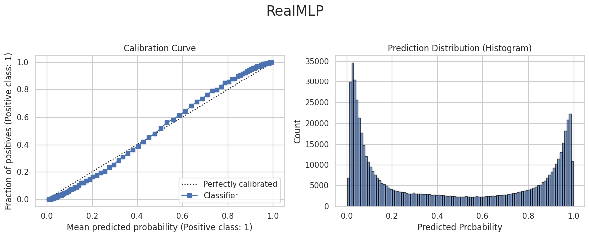
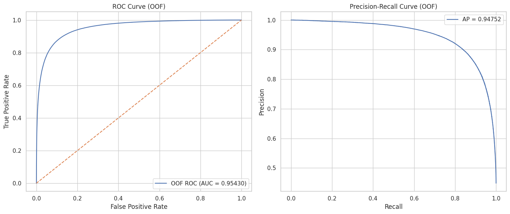
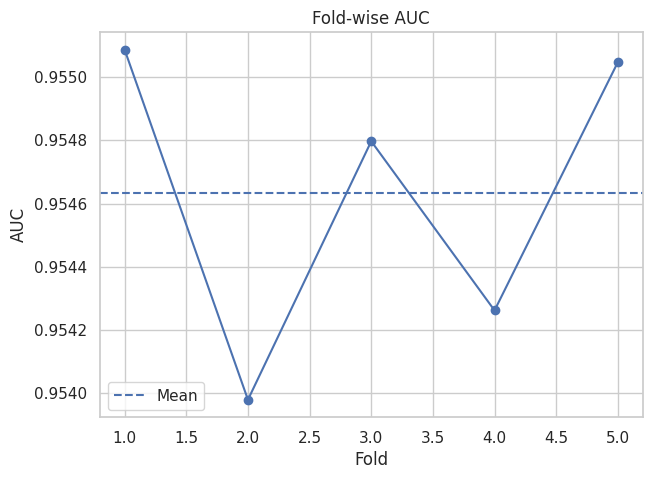

#### 20xx/mm/dd

- join!

**Submission**

- PL:
- Ranking:

---

#### 2026/02/01

- join!

**nb/000_eda.ipynb**:

- Age: Presence group is higher (mean 56 vs 52)
- Max HR: Presence group is lower (143 vs 160)
- ST depression: Presence group is significantly higher (1.17 vs 0.35) + higher zero rate
- Number of vessels fluro: Presence group is larger (0.84 vs 0.14)
- Thallium: Presence group larger (5.93 vs 3.55)
- BP shows almost no difference (based on current data)

- Performance: ROC-AUC ≈ 0.953
- Stability: std ≈ 0.0004

**Submission**

- PL:
- Ranking:

---

#### 2026/02/02

- Working on catboost

**nb/004_catboost.ipynb**

- CV AUC: mean 0.955501
    - std 0.000448
- best_iteration: [1183, 972, 1566, 1187, 1424]
    - median = 1187
    - mean = 1266.4

👉 final_iterations = int(1187 \* 1.15) = 1365 (rounded down) = 1400

| fold | roc_auc  | best_iteration |
| ---- | -------- | -------------- |
| 1    | 0.955856 | 1183.0         |
| 2    | 0.954810 | 972.0          |
| 3    | 0.955629 | 1566.0         |
| 4    | 0.955181 | 1187.0         |
| 5    | 0.956030 | 1424.0         |
| mean | 0.955501 | 1266.4         |
| std  | 0.000448 | NaN            |

**006_catboost_features**

- Incorporate sweep's "winning parameters" into production:
    - depth (4/5/6)
    - l2_leaf_reg (around 3/5/10)
    - rsm (0.7-0.9)
    - bootstrap_type + (subsample or bagging_temperature)
    - random_strength
- Highly robust "multi-seed average" ensemble: submit by averaging the test_pred of 5 models with random_seed = 42, 202, 777, 1337, 31415.

**007_catboost_features**

- Early stopping is not performed on the Submit side (a huge waste)
- Seed ensemble:
    - Vary 5-10 random seeds
    - For each seed, run 5-fold cross-validation and average the test predictions
    - Finally, average the seeds
- Mix "fast sweep top performers" in the model difference ensemble

👉 This took above 9 hours of execution due to GPU usage failure

**Submission**

- PL:
- Ranking:

---

#### 2026/02/03

- UTC time is 9:00 on GMT+9

**Submission**

- PL:
- Ranking:

---

#### 2026/02/04

**007_catboost_features**

- 5-fold base CV: mean AUC ≈ 0.95550
- Final Ensemble OOF: 0.955425
- Kaggle Public: 0.95351

This difference (approx. 0.0019) is commonly observed in this type of small-scale tabular data. There are two main reasons:

OOF optimization leans too heavily on the CV split (strong 'luck of the split').
By fixing StratifiedKFold to random_state=42, settings that "perform well" on that specific fold are chosen.

Model differences are almost identical (highly correlated), so ensembling doesn't improve the Public score.
This is exemplified by the nearly identical fold AUCs for 'base' and 'rand_strength2'.

**Submission**

- PL:
- Ranking:

---

#### 2026/02/07

**009_nb**:

- **Age_X_Cholesterol Feature (-0.00010 to -0.00015)**

    ```python
    train["Age_X_Cholesterol"] = (train["Age"] * train["Cholesterol"]).astype(float)
    ```

    - **Problem:** This creates a NUMERIC feature (values 7,000-20,000+)
    - **Not added** to `cat_cols_model` → CatBoost treats as continuous
    - **Result:** Just noise, no clear pattern, hurts performance

- **Aggressive Hyperparameters (-0.00005 to -0.00010)**
  You changed 5 parameters at once:
    - `bootstrap_type="Bayesian"` + `bagging_temperature=1.0` → Too aggressive for 270k dataset
    - `random_strength=1.0` → May not help
    - `od_wait=120` (was 150) → Stopping too early
    - `l2_leaf_reg=5` → Too much regularization

**010_remove_age_cholesterol**:

- PL:0.95342

- **TOO MANY FEATURES (27 total!)**
    - You added 12 new features at once
    - Many are redundant: Age_bucket + Age_X_Sex, 3× MaxHR features, etc.
    - Model is **memorizing training patterns** that don't generalize

- **WRONG HYPERPARAMETERS**
    - Your sweep found **depth=4** works best (0.956203)
    - But you used **depth=6** (not even in top 10!)
    - Used **l2_leaf_reg=3** (sweep says 5-10 is better)
    - Result: Too deep + too little regularization = overfitting

- **Complexity Paradox**
    - V3: Simple (15 features) → LB 0.95366 ✓
    - V5: Complex (27 features) → LB 0.95342 ✗
    - **More features made it WORSE!**

**Submission**

- PL:
- Ranking:

---

#### 2026/02/09

**013_multiple-models-for-eda-lb-0-95371**

| Title                                        | Author        | PL      | Link 🔗                                                                                                     |
| -------------------------------------------- | ------------- | ------- | ----------------------------------------------------------------------------------------------------------- |
| Multiple Models for ❤️ EDA 📊 LB: 0.95372 ⬆️ | Taimour Nazar | 0.95372 | [Link 🔗](https://www.kaggle.com/code/taimour/multiple-models-for-eda-lb-0-95372?scriptVersionId=296056995) |

**Submission**

- PL:
- Ranking:

---

#### 2026/02/10

**nb_download/predicting-heart-disease-kaggle-competition.ipynb**

| Title                                         | Author        | PL      | Link 🔗                                                                                        |
| --------------------------------------------- | ------------- | ------- | ---------------------------------------------------------------------------------------------- |
| Predicting Heart Disease Predicte652          | Kamran Ahmed  | 0.95397 | [Link 🔗](https://www.kaggle.com/code/kami1976/predicting-heart-disease-predicte652)           |
| RealMLP + Ext. Target Stats 5-Fold CV         | HARUKI HARADA | 0.95397 | [Link 🔗](https://www.kaggle.com/code/harukiharada/realmlp-ext-target-stats-5-fold-cv)         |
| Predicting Heart Disease (Kaggle Competition) | Emran Albeik  | 0.95388 | [Link 🔗](https://www.kaggle.com/code/emranalbiek/predicting-heart-disease-kaggle-competition) |

**nb/016_real-mlp.ipynb**:

**Submission**

- PL:
- Ranking:

---

#### 2026/02/10

**019_numeric_or_categorical**:

- [Link🔗](https://github.com/morshoto/predicting_heart_disease/issues/1)
- Run a baseline comparison where numeric features (age, BP, cholesterol, etc.) are kept continuous instead of being cast to categorical.
- Base question: with all categorization, it did actually improved PB, but this is very skeptical. With numerical data, we have benefit of continuous values. So I want to test if categorization would actually improve or not

| config             | mean_auc | std_auc  | fold_1   | fold_2   | fold_3   | fold_4   | fold_5   |
| ------------------ | -------- | -------- | -------- | -------- | -------- | -------- | -------- |
| categorical_binned | 0.955096 | 0.000409 | 0.955476 | 0.954480 | 0.955103 | 0.954832 | 0.955590 |
| numeric_continuous | 0.955078 | 0.000472 | 0.955515 | 0.954401 | 0.955082 | 0.954731 | 0.955664 |

<details><summary>Click here for more details</summary>
<code>
    ===== RealMLP: categorical_binned =====

    --- Starting Fold 1 ---
    Columns classified as continuous: ['Age', 'BP', 'Cholesterol', 'Max HR', 'ST depression', 'Sex_freq', 'Chest pain type_freq', 'FBS over 120_freq', 'EKG results_freq', 'Exercise angina_freq', 'Slope of ST_freq', 'Number of vessels fluro_freq', 'Thallium_freq']
    Columns classified as categorical: ['Sex', 'Chest pain type', 'FBS over 120', 'EKG results', 'Exercise angina', 'Slope of ST', 'Number of vessels fluro', 'Thallium', 'Age_bin', 'BP_bin', 'Cholesterol_bin', 'Max HR_bin', 'ST depression_bin']
    INFO:pytorch_lightning.utilities.rank_zero:GPU available: True (cuda), used: True
    INFO:pytorch_lightning.utilities.rank_zero:TPU available: False, using: 0 TPU cores
    INFO:pytorch_lightning.utilities.rank_zero:💡 Tip: For seamless cloud logging and experiment tracking, try installing [litlogger](https://pypi.org/project/litlogger/) to enable LitLogger, which logs metrics and artifacts automatically to the Lightning Experiments platform.
    INFO:pytorch_lightning.accelerators.cuda:LOCAL_RANK: 0 - CUDA_VISIBLE_DEVICES: [0]
    Epoch 1/100: val 1-auc_ovr = 0.045554
    Epoch 2/100: val 1-auc_ovr = 0.045526
    Epoch 3/100: val 1-auc_ovr = 0.045300
    Epoch 4/100: val 1-auc_ovr = 0.045083
    Epoch 5/100: val 1-auc_ovr = 0.044875
    Epoch 6/100: val 1-auc_ovr = 0.044760
    Epoch 7/100: val 1-auc_ovr = 0.044721
    Epoch 8/100: val 1-auc_ovr = 0.044838
    Epoch 9/100: val 1-auc_ovr = 0.044826
    Epoch 10/100: val 1-auc_ovr = 0.044950
    Epoch 11/100: val 1-auc_ovr = 0.045027
    Epoch 12/100: val 1-auc_ovr = 0.044931
    Epoch 13/100: val 1-auc_ovr = 0.045049
    Epoch 14/100: val 1-auc_ovr = 0.044913
    Epoch 15/100: val 1-auc_ovr = 0.044821
    Epoch 16/100: val 1-auc_ovr = 0.044687
    Epoch 17/100: val 1-auc_ovr = 0.044674
    Epoch 18/100: val 1-auc_ovr = 0.044586
    Epoch 19/100: val 1-auc_ovr = 0.044539
    Epoch 20/100: val 1-auc_ovr = 0.044534
    Epoch 21/100: val 1-auc_ovr = 0.044524
    Epoch 22/100: val 1-auc_ovr = 0.044541
    Epoch 23/100: val 1-auc_ovr = 0.044601
    Epoch 24/100: val 1-auc_ovr = 0.044644
    Epoch 25/100: val 1-auc_ovr = 0.044778
    Epoch 26/100: val 1-auc_ovr = 0.044699
    Epoch 27/100: val 1-auc_ovr = 0.044899
    Epoch 28/100: val 1-auc_ovr = 0.044800
    Epoch 29/100: val 1-auc_ovr = 0.044766
    Epoch 30/100: val 1-auc_ovr = 0.045021
    Epoch 31/100: val 1-auc_ovr = 0.044863
    Epoch 32/100: val 1-auc_ovr = 0.044886
    Epoch 33/100: val 1-auc_ovr = 0.044893
    Epoch 34/100: val 1-auc_ovr = 0.044881
    Epoch 35/100: val 1-auc_ovr = 0.044806
    Epoch 36/100: val 1-auc_ovr = 0.044758
    Epoch 37/100: val 1-auc_ovr = 0.044757
    Epoch 38/100: val 1-auc_ovr = 0.044770
    Epoch 39/100: val 1-auc_ovr = 0.044609
    Epoch 40/100: val 1-auc_ovr = 0.044623
    Epoch 41/100: val 1-auc_ovr = 0.044623
    Epoch 42/100: val 1-auc_ovr = 0.044537
    INFO:pytorch_lightning.utilities.rank_zero:GPU available: True (cuda), used: True
    INFO:pytorch_lightning.utilities.rank_zero:TPU available: False, using: 0 TPU cores
    INFO:pytorch_lightning.utilities.rank_zero:💡 Tip: For seamless cloud logging and experiment tracking, try installing [litlogger](https://pypi.org/project/litlogger/) to enable LitLogger, which logs metrics and artifacts automatically to the Lightning Experiments platform.
    INFO:pytorch_lightning.accelerators.cuda:LOCAL_RANK: 0 - CUDA_VISIBLE_DEVICES: [0]
    INFO:pytorch_lightning.utilities.rank_zero:GPU available: True (cuda), used: True
    INFO:pytorch_lightning.utilities.rank_zero:TPU available: False, using: 0 TPU cores
    INFO:pytorch_lightning.utilities.rank_zero:💡 Tip: For seamless cloud logging and experiment tracking, try installing [litlogger](https://pypi.org/project/litlogger/) to enable LitLogger, which logs metrics and artifacts automatically to the Lightning Experiments platform.
    INFO:pytorch_lightning.accelerators.cuda:LOCAL_RANK: 0 - CUDA_VISIBLE_DEVICES: [0]
    Fold 1 ROC-AUC Score: 0.95548

    --- Starting Fold 2 ---
    Columns classified as continuous: ['Age', 'BP', 'Cholesterol', 'Max HR', 'ST depression', 'Sex_freq', 'Chest pain type_freq', 'FBS over 120_freq', 'EKG results_freq', 'Exercise angina_freq', 'Slope of ST_freq', 'Number of vessels fluro_freq', 'Thallium_freq']
    Columns classified as categorical: ['Sex', 'Chest pain type', 'FBS over 120', 'EKG results', 'Exercise angina', 'Slope of ST', 'Number of vessels fluro', 'Thallium', 'Age_bin', 'BP_bin', 'Cholesterol_bin', 'Max HR_bin', 'ST depression_bin']
    INFO:pytorch_lightning.utilities.rank_zero:GPU available: True (cuda), used: True
    INFO:pytorch_lightning.utilities.rank_zero:TPU available: False, using: 0 TPU cores
    INFO:pytorch_lightning.utilities.rank_zero:💡 Tip: For seamless cloud logging and experiment tracking, try installing [litlogger](https://pypi.org/project/litlogger/) to enable LitLogger, which logs metrics and artifacts automatically to the Lightning Experiments platform.
    INFO:pytorch_lightning.accelerators.cuda:LOCAL_RANK: 0 - CUDA_VISIBLE_DEVICES: [0]
    Epoch 1/100: val 1-auc_ovr = 0.046640
    Epoch 2/100: val 1-auc_ovr = 0.046395
    Epoch 3/100: val 1-auc_ovr = 0.046248
    Epoch 4/100: val 1-auc_ovr = 0.046059
    Epoch 5/100: val 1-auc_ovr = 0.045908
    Epoch 6/100: val 1-auc_ovr = 0.045791
    Epoch 7/100: val 1-auc_ovr = 0.045780
    Epoch 8/100: val 1-auc_ovr = 0.045805
    Epoch 9/100: val 1-auc_ovr = 0.045939
    Epoch 10/100: val 1-auc_ovr = 0.045895
    Epoch 11/100: val 1-auc_ovr = 0.045965
    Epoch 12/100: val 1-auc_ovr = 0.046037
    Epoch 13/100: val 1-auc_ovr = 0.046031
    Epoch 14/100: val 1-auc_ovr = 0.046064
    Epoch 15/100: val 1-auc_ovr = 0.045851
    Epoch 16/100: val 1-auc_ovr = 0.045808
    Epoch 17/100: val 1-auc_ovr = 0.045713
    Epoch 18/100: val 1-auc_ovr = 0.045651
    Epoch 19/100: val 1-auc_ovr = 0.045613
    Epoch 20/100: val 1-auc_ovr = 0.045594
    Epoch 21/100: val 1-auc_ovr = 0.045591
    Epoch 22/100: val 1-auc_ovr = 0.045645
    Epoch 23/100: val 1-auc_ovr = 0.045672
    Epoch 24/100: val 1-auc_ovr = 0.045678
    Epoch 25/100: val 1-auc_ovr = 0.045782
    Epoch 26/100: val 1-auc_ovr = 0.045832
    Epoch 27/100: val 1-auc_ovr = 0.045755
    Epoch 28/100: val 1-auc_ovr = 0.045781
    Epoch 29/100: val 1-auc_ovr = 0.046001
    Epoch 30/100: val 1-auc_ovr = 0.046060
    Epoch 31/100: val 1-auc_ovr = 0.045931
    Epoch 32/100: val 1-auc_ovr = 0.045936
    Epoch 33/100: val 1-auc_ovr = 0.045853
    Epoch 34/100: val 1-auc_ovr = 0.045988
    Epoch 35/100: val 1-auc_ovr = 0.045923
    Epoch 36/100: val 1-auc_ovr = 0.045741
    Epoch 37/100: val 1-auc_ovr = 0.045731
    Epoch 38/100: val 1-auc_ovr = 0.045718
    Epoch 39/100: val 1-auc_ovr = 0.045786
    Epoch 40/100: val 1-auc_ovr = 0.045673
    Epoch 41/100: val 1-auc_ovr = 0.045583
    Epoch 42/100: val 1-auc_ovr = 0.045569
    Epoch 43/100: val 1-auc_ovr = 0.045561
    Epoch 44/100: val 1-auc_ovr = 0.045520
    Epoch 45/100: val 1-auc_ovr = 0.045563
    Epoch 46/100: val 1-auc_ovr = 0.045537
    Epoch 47/100: val 1-auc_ovr = 0.045534
    Epoch 48/100: val 1-auc_ovr = 0.045533
    Epoch 49/100: val 1-auc_ovr = 0.045523
    Epoch 50/100: val 1-auc_ovr = 0.045537
    Epoch 51/100: val 1-auc_ovr = 0.045588
    Epoch 52/100: val 1-auc_ovr = 0.045590
    Epoch 53/100: val 1-auc_ovr = 0.045642
    Epoch 54/100: val 1-auc_ovr = 0.045597
    Epoch 55/100: val 1-auc_ovr = 0.045726
    Epoch 56/100: val 1-auc_ovr = 0.045684
    Epoch 57/100: val 1-auc_ovr = 0.045743
    Epoch 58/100: val 1-auc_ovr = 0.045766
    Epoch 59/100: val 1-auc_ovr = 0.045738
    Epoch 60/100: val 1-auc_ovr = 0.045924
    Epoch 61/100: val 1-auc_ovr = 0.045846
    Epoch 62/100: val 1-auc_ovr = 0.045972
    Epoch 63/100: val 1-auc_ovr = 0.045896
    Epoch 64/100: val 1-auc_ovr = 0.045817
    Epoch 65/100: val 1-auc_ovr = 0.045935
    INFO:pytorch_lightning.utilities.rank_zero:GPU available: True (cuda), used: True
    INFO:pytorch_lightning.utilities.rank_zero:TPU available: False, using: 0 TPU cores
    INFO:pytorch_lightning.utilities.rank_zero:💡 Tip: For seamless cloud logging and experiment tracking, try installing [litlogger](https://pypi.org/project/litlogger/) to enable LitLogger, which logs metrics and artifacts automatically to the Lightning Experiments platform.
    INFO:pytorch_lightning.accelerators.cuda:LOCAL_RANK: 0 - CUDA_VISIBLE_DEVICES: [0]
    INFO:pytorch_lightning.utilities.rank_zero:GPU available: True (cuda), used: True
    INFO:pytorch_lightning.utilities.rank_zero:TPU available: False, using: 0 TPU cores
    INFO:pytorch_lightning.utilities.rank_zero:💡 Tip: For seamless cloud logging and experiment tracking, try installing [litlogger](https://pypi.org/project/litlogger/) to enable LitLogger, which logs metrics and artifacts automatically to the Lightning Experiments platform.
    INFO:pytorch_lightning.accelerators.cuda:LOCAL_RANK: 0 - CUDA_VISIBLE_DEVICES: [0]
    Fold 2 ROC-AUC Score: 0.95448

    --- Starting Fold 3 ---
    Columns classified as continuous: ['Age', 'BP', 'Cholesterol', 'Max HR', 'ST depression', 'Sex_freq', 'Chest pain type_freq', 'FBS over 120_freq', 'EKG results_freq', 'Exercise angina_freq', 'Slope of ST_freq', 'Number of vessels fluro_freq', 'Thallium_freq']
    Columns classified as categorical: ['Sex', 'Chest pain type', 'FBS over 120', 'EKG results', 'Exercise angina', 'Slope of ST', 'Number of vessels fluro', 'Thallium', 'Age_bin', 'BP_bin', 'Cholesterol_bin', 'Max HR_bin', 'ST depression_bin']
    INFO:pytorch_lightning.utilities.rank_zero:GPU available: True (cuda), used: True
    INFO:pytorch_lightning.utilities.rank_zero:TPU available: False, using: 0 TPU cores
    INFO:pytorch_lightning.utilities.rank_zero:💡 Tip: For seamless cloud logging and experiment tracking, try installing [litlogger](https://pypi.org/project/litlogger/) to enable LitLogger, which logs metrics and artifacts automatically to the Lightning Experiments platform.
    INFO:pytorch_lightning.accelerators.cuda:LOCAL_RANK: 0 - CUDA_VISIBLE_DEVICES: [0]
    Epoch 1/100: val 1-auc_ovr = 0.045890
    Epoch 2/100: val 1-auc_ovr = 0.045742
    Epoch 3/100: val 1-auc_ovr = 0.045536
    Epoch 4/100: val 1-auc_ovr = 0.045246
    Epoch 5/100: val 1-auc_ovr = 0.045297
    Epoch 6/100: val 1-auc_ovr = 0.045069
    Epoch 7/100: val 1-auc_ovr = 0.045036
    Epoch 8/100: val 1-auc_ovr = 0.045076
    Epoch 9/100: val 1-auc_ovr = 0.045264
    Epoch 10/100: val 1-auc_ovr = 0.045279
    Epoch 11/100: val 1-auc_ovr = 0.045269
    Epoch 12/100: val 1-auc_ovr = 0.045265
    Epoch 13/100: val 1-auc_ovr = 0.045340
    Epoch 14/100: val 1-auc_ovr = 0.045264
    Epoch 15/100: val 1-auc_ovr = 0.045135
    Epoch 16/100: val 1-auc_ovr = 0.045016
    Epoch 17/100: val 1-auc_ovr = 0.044970
    Epoch 18/100: val 1-auc_ovr = 0.044935
    Epoch 19/100: val 1-auc_ovr = 0.044911
    Epoch 20/100: val 1-auc_ovr = 0.044897
    Epoch 21/100: val 1-auc_ovr = 0.044905
    Epoch 22/100: val 1-auc_ovr = 0.044988
    Epoch 23/100: val 1-auc_ovr = 0.044943
    Epoch 24/100: val 1-auc_ovr = 0.044952
    Epoch 25/100: val 1-auc_ovr = 0.045006
    Epoch 26/100: val 1-auc_ovr = 0.045079
    Epoch 27/100: val 1-auc_ovr = 0.045254
    Epoch 28/100: val 1-auc_ovr = 0.045234
    Epoch 29/100: val 1-auc_ovr = 0.045265
    Epoch 30/100: val 1-auc_ovr = 0.045299
    Epoch 31/100: val 1-auc_ovr = 0.045214
    Epoch 32/100: val 1-auc_ovr = 0.045286
    Epoch 33/100: val 1-auc_ovr = 0.045243
    Epoch 34/100: val 1-auc_ovr = 0.045228
    Epoch 35/100: val 1-auc_ovr = 0.045189
    Epoch 36/100: val 1-auc_ovr = 0.045209
    Epoch 37/100: val 1-auc_ovr = 0.045110
    Epoch 38/100: val 1-auc_ovr = 0.045213
    Epoch 39/100: val 1-auc_ovr = 0.045049
    Epoch 40/100: val 1-auc_ovr = 0.045053
    Epoch 41/100: val 1-auc_ovr = 0.044964
    INFO:pytorch_lightning.utilities.rank_zero:GPU available: True (cuda), used: True
    INFO:pytorch_lightning.utilities.rank_zero:TPU available: False, using: 0 TPU cores
    INFO:pytorch_lightning.utilities.rank_zero:💡 Tip: For seamless cloud logging and experiment tracking, try installing [litlogger](https://pypi.org/project/litlogger/) to enable LitLogger, which logs metrics and artifacts automatically to the Lightning Experiments platform.
    INFO:pytorch_lightning.accelerators.cuda:LOCAL_RANK: 0 - CUDA_VISIBLE_DEVICES: [0]
    INFO:pytorch_lightning.utilities.rank_zero:GPU available: True (cuda), used: True
    INFO:pytorch_lightning.utilities.rank_zero:TPU available: False, using: 0 TPU cores
    INFO:pytorch_lightning.utilities.rank_zero:💡 Tip: For seamless cloud logging and experiment tracking, try installing [litlogger](https://pypi.org/project/litlogger/) to enable LitLogger, which logs metrics and artifacts automatically to the Lightning Experiments platform.
    INFO:pytorch_lightning.accelerators.cuda:LOCAL_RANK: 0 - CUDA_VISIBLE_DEVICES: [0]
    Fold 3 ROC-AUC Score: 0.95510

    --- Starting Fold 4 ---
    Columns classified as continuous: ['Age', 'BP', 'Cholesterol', 'Max HR', 'ST depression', 'Sex_freq', 'Chest pain type_freq', 'FBS over 120_freq', 'EKG results_freq', 'Exercise angina_freq', 'Slope of ST_freq', 'Number of vessels fluro_freq', 'Thallium_freq']
    Columns classified as categorical: ['Sex', 'Chest pain type', 'FBS over 120', 'EKG results', 'Exercise angina', 'Slope of ST', 'Number of vessels fluro', 'Thallium', 'Age_bin', 'BP_bin', 'Cholesterol_bin', 'Max HR_bin', 'ST depression_bin']
    INFO:pytorch_lightning.utilities.rank_zero:GPU available: True (cuda), used: True
    INFO:pytorch_lightning.utilities.rank_zero:TPU available: False, using: 0 TPU cores
    INFO:pytorch_lightning.utilities.rank_zero:💡 Tip: For seamless cloud logging and experiment tracking, try installing [litlogger](https://pypi.org/project/litlogger/) to enable LitLogger, which logs metrics and artifacts automatically to the Lightning Experiments platform.
    INFO:pytorch_lightning.accelerators.cuda:LOCAL_RANK: 0 - CUDA_VISIBLE_DEVICES: [0]
    Epoch 1/100: val 1-auc_ovr = 0.046200
    Epoch 2/100: val 1-auc_ovr = 0.046072
    Epoch 3/100: val 1-auc_ovr = 0.045936
    Epoch 4/100: val 1-auc_ovr = 0.045799
    Epoch 5/100: val 1-auc_ovr = 0.045571
    Epoch 6/100: val 1-auc_ovr = 0.045414
    Epoch 7/100: val 1-auc_ovr = 0.045380
    Epoch 8/100: val 1-auc_ovr = 0.045393
    Epoch 9/100: val 1-auc_ovr = 0.045469
    Epoch 10/100: val 1-auc_ovr = 0.045590
    Epoch 11/100: val 1-auc_ovr = 0.045735
    Epoch 12/100: val 1-auc_ovr = 0.045723
    Epoch 13/100: val 1-auc_ovr = 0.045707
    Epoch 14/100: val 1-auc_ovr = 0.045640
    Epoch 15/100: val 1-auc_ovr = 0.045484
    Epoch 16/100: val 1-auc_ovr = 0.045444
    Epoch 17/100: val 1-auc_ovr = 0.045314
    Epoch 18/100: val 1-auc_ovr = 0.045227
    Epoch 19/100: val 1-auc_ovr = 0.045192
    Epoch 20/100: val 1-auc_ovr = 0.045168
    Epoch 21/100: val 1-auc_ovr = 0.045175
    Epoch 22/100: val 1-auc_ovr = 0.045218
    Epoch 23/100: val 1-auc_ovr = 0.045246
    Epoch 24/100: val 1-auc_ovr = 0.045330
    Epoch 25/100: val 1-auc_ovr = 0.045470
    Epoch 26/100: val 1-auc_ovr = 0.045419
    Epoch 27/100: val 1-auc_ovr = 0.045474
    Epoch 28/100: val 1-auc_ovr = 0.045580
    Epoch 29/100: val 1-auc_ovr = 0.045675
    Epoch 30/100: val 1-auc_ovr = 0.045646
    Epoch 31/100: val 1-auc_ovr = 0.045666
    Epoch 32/100: val 1-auc_ovr = 0.045562
    Epoch 33/100: val 1-auc_ovr = 0.045589
    Epoch 34/100: val 1-auc_ovr = 0.045498
    Epoch 35/100: val 1-auc_ovr = 0.045492
    Epoch 36/100: val 1-auc_ovr = 0.045579
    Epoch 37/100: val 1-auc_ovr = 0.045503
    Epoch 38/100: val 1-auc_ovr = 0.045358
    Epoch 39/100: val 1-auc_ovr = 0.045368
    Epoch 40/100: val 1-auc_ovr = 0.045296
    Epoch 41/100: val 1-auc_ovr = 0.045231
    INFO:pytorch_lightning.utilities.rank_zero:GPU available: True (cuda), used: True
    INFO:pytorch_lightning.utilities.rank_zero:TPU available: False, using: 0 TPU cores
    INFO:pytorch_lightning.utilities.rank_zero:💡 Tip: For seamless cloud logging and experiment tracking, try installing [litlogger](https://pypi.org/project/litlogger/) to enable LitLogger, which logs metrics and artifacts automatically to the Lightning Experiments platform.
    INFO:pytorch_lightning.accelerators.cuda:LOCAL_RANK: 0 - CUDA_VISIBLE_DEVICES: [0]
    INFO:pytorch_lightning.utilities.rank_zero:GPU available: True (cuda), used: True
    INFO:pytorch_lightning.utilities.rank_zero:TPU available: False, using: 0 TPU cores
    INFO:pytorch_lightning.utilities.rank_zero:💡 Tip: For seamless cloud logging and experiment tracking, try installing [litlogger](https://pypi.org/project/litlogger/) to enable LitLogger, which logs metrics and artifacts automatically to the Lightning Experiments platform.
    INFO:pytorch_lightning.accelerators.cuda:LOCAL_RANK: 0 - CUDA_VISIBLE_DEVICES: [0]
    Fold 4 ROC-AUC Score: 0.95483

    --- Starting Fold 5 ---
    Columns classified as continuous: ['Age', 'BP', 'Cholesterol', 'Max HR', 'ST depression', 'Sex_freq', 'Chest pain type_freq', 'FBS over 120_freq', 'EKG results_freq', 'Exercise angina_freq', 'Slope of ST_freq', 'Number of vessels fluro_freq', 'Thallium_freq']
    Columns classified as categorical: ['Sex', 'Chest pain type', 'FBS over 120', 'EKG results', 'Exercise angina', 'Slope of ST', 'Number of vessels fluro', 'Thallium', 'Age_bin', 'BP_bin', 'Cholesterol_bin', 'Max HR_bin', 'ST depression_bin']
    INFO:pytorch_lightning.utilities.rank_zero:GPU available: True (cuda), used: True
    INFO:pytorch_lightning.utilities.rank_zero:TPU available: False, using: 0 TPU cores
    INFO:pytorch_lightning.utilities.rank_zero:💡 Tip: For seamless cloud logging and experiment tracking, try installing [litlogger](https://pypi.org/project/litlogger/) to enable LitLogger, which logs metrics and artifacts automatically to the Lightning Experiments platform.
    INFO:pytorch_lightning.accelerators.cuda:LOCAL_RANK: 0 - CUDA_VISIBLE_DEVICES: [0]
    Epoch 1/100: val 1-auc_ovr = 0.045511
    Epoch 2/100: val 1-auc_ovr = 0.045357
    Epoch 3/100: val 1-auc_ovr = 0.045168
    Epoch 4/100: val 1-auc_ovr = 0.044978
    Epoch 5/100: val 1-auc_ovr = 0.044844
    Epoch 6/100: val 1-auc_ovr = 0.044724
    Epoch 7/100: val 1-auc_ovr = 0.044701
    Epoch 8/100: val 1-auc_ovr = 0.044747
    Epoch 9/100: val 1-auc_ovr = 0.044749
    Epoch 10/100: val 1-auc_ovr = 0.044881
    Epoch 11/100: val 1-auc_ovr = 0.045031
    Epoch 12/100: val 1-auc_ovr = 0.044841
    Epoch 13/100: val 1-auc_ovr = 0.044724
    Epoch 14/100: val 1-auc_ovr = 0.044943
    Epoch 15/100: val 1-auc_ovr = 0.044692
    Epoch 16/100: val 1-auc_ovr = 0.044589
    Epoch 17/100: val 1-auc_ovr = 0.044550
    Epoch 18/100: val 1-auc_ovr = 0.044481
    Epoch 19/100: val 1-auc_ovr = 0.044424
    Epoch 20/100: val 1-auc_ovr = 0.044421
    Epoch 21/100: val 1-auc_ovr = 0.044410
    Epoch 22/100: val 1-auc_ovr = 0.044469
    Epoch 23/100: val 1-auc_ovr = 0.044486
    Epoch 24/100: val 1-auc_ovr = 0.044705
    Epoch 25/100: val 1-auc_ovr = 0.044580
    Epoch 26/100: val 1-auc_ovr = 0.044645
    Epoch 27/100: val 1-auc_ovr = 0.044711
    Epoch 28/100: val 1-auc_ovr = 0.044792
    Epoch 29/100: val 1-auc_ovr = 0.044776
    Epoch 30/100: val 1-auc_ovr = 0.044722
    Epoch 31/100: val 1-auc_ovr = 0.044732
    Epoch 32/100: val 1-auc_ovr = 0.044912
    Epoch 33/100: val 1-auc_ovr = 0.044826
    Epoch 34/100: val 1-auc_ovr = 0.044590
    Epoch 35/100: val 1-auc_ovr = 0.044772
    Epoch 36/100: val 1-auc_ovr = 0.044663
    Epoch 37/100: val 1-auc_ovr = 0.044577
    Epoch 38/100: val 1-auc_ovr = 0.044586
    Epoch 39/100: val 1-auc_ovr = 0.044558
    Epoch 40/100: val 1-auc_ovr = 0.044485
    Epoch 41/100: val 1-auc_ovr = 0.044452
    Epoch 42/100: val 1-auc_ovr = 0.044428
    INFO:pytorch_lightning.utilities.rank_zero:GPU available: True (cuda), used: True
    INFO:pytorch_lightning.utilities.rank_zero:TPU available: False, using: 0 TPU cores
    INFO:pytorch_lightning.utilities.rank_zero:💡 Tip: For seamless cloud logging and experiment tracking, try installing [litlogger](https://pypi.org/project/litlogger/) to enable LitLogger, which logs metrics and artifacts automatically to the Lightning Experiments platform.
    INFO:pytorch_lightning.accelerators.cuda:LOCAL_RANK: 0 - CUDA_VISIBLE_DEVICES: [0]
    INFO:pytorch_lightning.utilities.rank_zero:GPU available: True (cuda), used: True
    INFO:pytorch_lightning.utilities.rank_zero:TPU available: False, using: 0 TPU cores
    INFO:pytorch_lightning.utilities.rank_zero:💡 Tip: For seamless cloud logging and experiment tracking, try installing [litlogger](https://pypi.org/project/litlogger/) to enable LitLogger, which logs metrics and artifacts automatically to the Lightning Experiments platform.
    INFO:pytorch_lightning.accelerators.cuda:LOCAL_RANK: 0 - CUDA_VISIBLE_DEVICES: [0]
    Fold 5 ROC-AUC Score: 0.95559

    ===== RealMLP: numeric_continuous =====

    --- Starting Fold 1 ---
    Columns classified as continuous: ['Age', 'BP', 'Cholesterol', 'Max HR', 'ST depression', 'Sex_freq', 'Chest pain type_freq', 'FBS over 120_freq', 'EKG results_freq', 'Exercise angina_freq', 'Slope of ST_freq', 'Number of vessels fluro_freq', 'Thallium_freq']
    Columns classified as categorical: ['Sex', 'Chest pain type', 'FBS over 120', 'EKG results', 'Exercise angina', 'Slope of ST', 'Number of vessels fluro', 'Thallium']
    INFO:pytorch_lightning.utilities.rank_zero:GPU available: True (cuda), used: True
    INFO:pytorch_lightning.utilities.rank_zero:TPU available: False, using: 0 TPU cores
    INFO:pytorch_lightning.utilities.rank_zero:💡 Tip: For seamless cloud logging and experiment tracking, try installing [litlogger](https://pypi.org/project/litlogger/) to enable LitLogger, which logs metrics and artifacts automatically to the Lightning Experiments platform.
    INFO:pytorch_lightning.accelerators.cuda:LOCAL_RANK: 0 - CUDA_VISIBLE_DEVICES: [0]
    Epoch 1/100: val 1-auc_ovr = 0.045546
    Epoch 2/100: val 1-auc_ovr = 0.045452
    Epoch 3/100: val 1-auc_ovr = 0.045279
    Epoch 4/100: val 1-auc_ovr = 0.045139
    Epoch 5/100: val 1-auc_ovr = 0.044921
    Epoch 6/100: val 1-auc_ovr = 0.044817
    Epoch 7/100: val 1-auc_ovr = 0.044763
    Epoch 8/100: val 1-auc_ovr = 0.044868
    Epoch 9/100: val 1-auc_ovr = 0.044817
    Epoch 10/100: val 1-auc_ovr = 0.044974
    Epoch 11/100: val 1-auc_ovr = 0.044975
    Epoch 12/100: val 1-auc_ovr = 0.044963
    Epoch 13/100: val 1-auc_ovr = 0.045101
    Epoch 14/100: val 1-auc_ovr = 0.044905
    Epoch 15/100: val 1-auc_ovr = 0.044784
    Epoch 16/100: val 1-auc_ovr = 0.044634
    Epoch 17/100: val 1-auc_ovr = 0.044638
    Epoch 18/100: val 1-auc_ovr = 0.044583
    Epoch 19/100: val 1-auc_ovr = 0.044511
    Epoch 20/100: val 1-auc_ovr = 0.044500
    Epoch 21/100: val 1-auc_ovr = 0.044494
    Epoch 22/100: val 1-auc_ovr = 0.044485
    Epoch 23/100: val 1-auc_ovr = 0.044561
    Epoch 24/100: val 1-auc_ovr = 0.044597
    Epoch 25/100: val 1-auc_ovr = 0.044727
    Epoch 26/100: val 1-auc_ovr = 0.044707
    Epoch 27/100: val 1-auc_ovr = 0.044887
    Epoch 28/100: val 1-auc_ovr = 0.044823
    Epoch 29/100: val 1-auc_ovr = 0.044806
    Epoch 30/100: val 1-auc_ovr = 0.045005
    Epoch 31/100: val 1-auc_ovr = 0.044850
    Epoch 32/100: val 1-auc_ovr = 0.044847
    Epoch 33/100: val 1-auc_ovr = 0.044883
    Epoch 34/100: val 1-auc_ovr = 0.044843
    Epoch 35/100: val 1-auc_ovr = 0.044831
    Epoch 36/100: val 1-auc_ovr = 0.044743
    Epoch 37/100: val 1-auc_ovr = 0.044731
    Epoch 38/100: val 1-auc_ovr = 0.044761
    Epoch 39/100: val 1-auc_ovr = 0.044578
    Epoch 40/100: val 1-auc_ovr = 0.044646
    Epoch 41/100: val 1-auc_ovr = 0.044626
    Epoch 42/100: val 1-auc_ovr = 0.044519
    Epoch 43/100: val 1-auc_ovr = 0.044493
    INFO:pytorch_lightning.utilities.rank_zero:GPU available: True (cuda), used: True
    INFO:pytorch_lightning.utilities.rank_zero:TPU available: False, using: 0 TPU cores
    INFO:pytorch_lightning.utilities.rank_zero:💡 Tip: For seamless cloud logging and experiment tracking, try installing [litlogger](https://pypi.org/project/litlogger/) to enable LitLogger, which logs metrics and artifacts automatically to the Lightning Experiments platform.
    INFO:pytorch_lightning.accelerators.cuda:LOCAL_RANK: 0 - CUDA_VISIBLE_DEVICES: [0]
    INFO:pytorch_lightning.utilities.rank_zero:GPU available: True (cuda), used: True
    INFO:pytorch_lightning.utilities.rank_zero:TPU available: False, using: 0 TPU cores
    INFO:pytorch_lightning.utilities.rank_zero:💡 Tip: For seamless cloud logging and experiment tracking, try installing [litlogger](https://pypi.org/project/litlogger/) to enable LitLogger, which logs metrics and artifacts automatically to the Lightning Experiments platform.
    INFO:pytorch_lightning.accelerators.cuda:LOCAL_RANK: 0 - CUDA_VISIBLE_DEVICES: [0]
    Fold 1 ROC-AUC Score: 0.95551

    --- Starting Fold 2 ---
    Columns classified as continuous: ['Age', 'BP', 'Cholesterol', 'Max HR', 'ST depression', 'Sex_freq', 'Chest pain type_freq', 'FBS over 120_freq', 'EKG results_freq', 'Exercise angina_freq', 'Slope of ST_freq', 'Number of vessels fluro_freq', 'Thallium_freq']
    Columns classified as categorical: ['Sex', 'Chest pain type', 'FBS over 120', 'EKG results', 'Exercise angina', 'Slope of ST', 'Number of vessels fluro', 'Thallium']
    INFO:pytorch_lightning.utilities.rank_zero:GPU available: True (cuda), used: True
    INFO:pytorch_lightning.utilities.rank_zero:TPU available: False, using: 0 TPU cores
    INFO:pytorch_lightning.utilities.rank_zero:💡 Tip: For seamless cloud logging and experiment tracking, try installing [litlogger](https://pypi.org/project/litlogger/) to enable LitLogger, which logs metrics and artifacts automatically to the Lightning Experiments platform.
    INFO:pytorch_lightning.accelerators.cuda:LOCAL_RANK: 0 - CUDA_VISIBLE_DEVICES: [0]
    Epoch 1/100: val 1-auc_ovr = 0.046654
    Epoch 2/100: val 1-auc_ovr = 0.046336
    Epoch 3/100: val 1-auc_ovr = 0.046268
    Epoch 4/100: val 1-auc_ovr = 0.046051
    Epoch 5/100: val 1-auc_ovr = 0.045945
    Epoch 6/100: val 1-auc_ovr = 0.045846
    Epoch 7/100: val 1-auc_ovr = 0.045836
    Epoch 8/100: val 1-auc_ovr = 0.045878
    Epoch 9/100: val 1-auc_ovr = 0.045951
    Epoch 10/100: val 1-auc_ovr = 0.045952
    Epoch 11/100: val 1-auc_ovr = 0.046058
    Epoch 12/100: val 1-auc_ovr = 0.046111
    Epoch 13/100: val 1-auc_ovr = 0.046035
    Epoch 14/100: val 1-auc_ovr = 0.046052
    Epoch 15/100: val 1-auc_ovr = 0.045922
    Epoch 16/100: val 1-auc_ovr = 0.045898
    Epoch 17/100: val 1-auc_ovr = 0.045799
    Epoch 18/100: val 1-auc_ovr = 0.045751
    Epoch 19/100: val 1-auc_ovr = 0.045717
    Epoch 20/100: val 1-auc_ovr = 0.045704
    Epoch 21/100: val 1-auc_ovr = 0.045702
    Epoch 22/100: val 1-auc_ovr = 0.045754
    Epoch 23/100: val 1-auc_ovr = 0.045769
    Epoch 24/100: val 1-auc_ovr = 0.045803
    Epoch 25/100: val 1-auc_ovr = 0.045869
    Epoch 26/100: val 1-auc_ovr = 0.045843
    Epoch 27/100: val 1-auc_ovr = 0.045785
    Epoch 28/100: val 1-auc_ovr = 0.045804
    Epoch 29/100: val 1-auc_ovr = 0.045998
    Epoch 30/100: val 1-auc_ovr = 0.046075
    Epoch 31/100: val 1-auc_ovr = 0.046056
    Epoch 32/100: val 1-auc_ovr = 0.045888
    Epoch 33/100: val 1-auc_ovr = 0.045961
    Epoch 34/100: val 1-auc_ovr = 0.046011
    Epoch 35/100: val 1-auc_ovr = 0.045974
    Epoch 36/100: val 1-auc_ovr = 0.045732
    Epoch 37/100: val 1-auc_ovr = 0.045824
    Epoch 38/100: val 1-auc_ovr = 0.045780
    Epoch 39/100: val 1-auc_ovr = 0.045837
    Epoch 40/100: val 1-auc_ovr = 0.045708
    Epoch 41/100: val 1-auc_ovr = 0.045625
    Epoch 42/100: val 1-auc_ovr = 0.045638
    Epoch 43/100: val 1-auc_ovr = 0.045630
    Epoch 44/100: val 1-auc_ovr = 0.045599
    Epoch 45/100: val 1-auc_ovr = 0.045643
    Epoch 46/100: val 1-auc_ovr = 0.045617
    Epoch 47/100: val 1-auc_ovr = 0.045614
    Epoch 48/100: val 1-auc_ovr = 0.045609
    Epoch 49/100: val 1-auc_ovr = 0.045602
    Epoch 50/100: val 1-auc_ovr = 0.045615
    Epoch 51/100: val 1-auc_ovr = 0.045690
    Epoch 52/100: val 1-auc_ovr = 0.045672
    Epoch 53/100: val 1-auc_ovr = 0.045701
    Epoch 54/100: val 1-auc_ovr = 0.045699
    Epoch 55/100: val 1-auc_ovr = 0.045826
    Epoch 56/100: val 1-auc_ovr = 0.045757
    Epoch 57/100: val 1-auc_ovr = 0.045844
    Epoch 58/100: val 1-auc_ovr = 0.045843
    Epoch 59/100: val 1-auc_ovr = 0.045803
    Epoch 60/100: val 1-auc_ovr = 0.045991
    Epoch 61/100: val 1-auc_ovr = 0.045853
    Epoch 62/100: val 1-auc_ovr = 0.045982
    Epoch 63/100: val 1-auc_ovr = 0.045953
    Epoch 64/100: val 1-auc_ovr = 0.045902
    Epoch 65/100: val 1-auc_ovr = 0.045941
    INFO:pytorch_lightning.utilities.rank_zero:GPU available: True (cuda), used: True
    INFO:pytorch_lightning.utilities.rank_zero:TPU available: False, using: 0 TPU cores
    INFO:pytorch_lightning.utilities.rank_zero:💡 Tip: For seamless cloud logging and experiment tracking, try installing [litlogger](https://pypi.org/project/litlogger/) to enable LitLogger, which logs metrics and artifacts automatically to the Lightning Experiments platform.
    INFO:pytorch_lightning.accelerators.cuda:LOCAL_RANK: 0 - CUDA_VISIBLE_DEVICES: [0]
    INFO:pytorch_lightning.utilities.rank_zero:GPU available: True (cuda), used: True
    INFO:pytorch_lightning.utilities.rank_zero:TPU available: False, using: 0 TPU cores
    INFO:pytorch_lightning.utilities.rank_zero:💡 Tip: For seamless cloud logging and experiment tracking, try installing [litlogger](https://pypi.org/project/litlogger/) to enable LitLogger, which logs metrics and artifacts automatically to the Lightning Experiments platform.
    INFO:pytorch_lightning.accelerators.cuda:LOCAL_RANK: 0 - CUDA_VISIBLE_DEVICES: [0]
    Fold 2 ROC-AUC Score: 0.95440

    --- Starting Fold 3 ---
    Columns classified as continuous: ['Age', 'BP', 'Cholesterol', 'Max HR', 'ST depression', 'Sex_freq', 'Chest pain type_freq', 'FBS over 120_freq', 'EKG results_freq', 'Exercise angina_freq', 'Slope of ST_freq', 'Number of vessels fluro_freq', 'Thallium_freq']
    Columns classified as categorical: ['Sex', 'Chest pain type', 'FBS over 120', 'EKG results', 'Exercise angina', 'Slope of ST', 'Number of vessels fluro', 'Thallium']
    INFO:pytorch_lightning.utilities.rank_zero:GPU available: True (cuda), used: True
    INFO:pytorch_lightning.utilities.rank_zero:TPU available: False, using: 0 TPU cores
    INFO:pytorch_lightning.utilities.rank_zero:💡 Tip: For seamless cloud logging and experiment tracking, try installing [litlogger](https://pypi.org/project/litlogger/) to enable LitLogger, which logs metrics and artifacts automatically to the Lightning Experiments platform.
    INFO:pytorch_lightning.accelerators.cuda:LOCAL_RANK: 0 - CUDA_VISIBLE_DEVICES: [0]
    Epoch 1/100: val 1-auc_ovr = 0.045898
    Epoch 2/100: val 1-auc_ovr = 0.045715
    Epoch 3/100: val 1-auc_ovr = 0.045573
    Epoch 4/100: val 1-auc_ovr = 0.045304
    Epoch 5/100: val 1-auc_ovr = 0.045400
    Epoch 6/100: val 1-auc_ovr = 0.045173
    Epoch 7/100: val 1-auc_ovr = 0.045147
    Epoch 8/100: val 1-auc_ovr = 0.045181
    Epoch 9/100: val 1-auc_ovr = 0.045368
    Epoch 10/100: val 1-auc_ovr = 0.045294
    Epoch 11/100: val 1-auc_ovr = 0.045305
    Epoch 12/100: val 1-auc_ovr = 0.045354
    Epoch 13/100: val 1-auc_ovr = 0.045386
    Epoch 14/100: val 1-auc_ovr = 0.045241
    Epoch 15/100: val 1-auc_ovr = 0.045188
    Epoch 16/100: val 1-auc_ovr = 0.045018
    Epoch 17/100: val 1-auc_ovr = 0.044994
    Epoch 18/100: val 1-auc_ovr = 0.044925
    Epoch 19/100: val 1-auc_ovr = 0.044939
    Epoch 20/100: val 1-auc_ovr = 0.044918
    Epoch 21/100: val 1-auc_ovr = 0.044930
    Epoch 22/100: val 1-auc_ovr = 0.044992
    Epoch 23/100: val 1-auc_ovr = 0.044953
    Epoch 24/100: val 1-auc_ovr = 0.044975
    Epoch 25/100: val 1-auc_ovr = 0.045001
    Epoch 26/100: val 1-auc_ovr = 0.045103
    Epoch 27/100: val 1-auc_ovr = 0.045213
    Epoch 28/100: val 1-auc_ovr = 0.045197
    Epoch 29/100: val 1-auc_ovr = 0.045191
    Epoch 30/100: val 1-auc_ovr = 0.045208
    Epoch 31/100: val 1-auc_ovr = 0.045281
    Epoch 32/100: val 1-auc_ovr = 0.045289
    Epoch 33/100: val 1-auc_ovr = 0.045248
    Epoch 34/100: val 1-auc_ovr = 0.045232
    Epoch 35/100: val 1-auc_ovr = 0.045218
    Epoch 36/100: val 1-auc_ovr = 0.045179
    Epoch 37/100: val 1-auc_ovr = 0.045051
    Epoch 38/100: val 1-auc_ovr = 0.045192
    Epoch 39/100: val 1-auc_ovr = 0.045014
    Epoch 40/100: val 1-auc_ovr = 0.045033
    Epoch 41/100: val 1-auc_ovr = 0.044901
    INFO:pytorch_lightning.utilities.rank_zero:GPU available: True (cuda), used: True
    INFO:pytorch_lightning.utilities.rank_zero:TPU available: False, using: 0 TPU cores
    INFO:pytorch_lightning.utilities.rank_zero:💡 Tip: For seamless cloud logging and experiment tracking, try installing [litlogger](https://pypi.org/project/litlogger/) to enable LitLogger, which logs metrics and artifacts automatically to the Lightning Experiments platform.
    INFO:pytorch_lightning.accelerators.cuda:LOCAL_RANK: 0 - CUDA_VISIBLE_DEVICES: [0]
    INFO:pytorch_lightning.utilities.rank_zero:GPU available: True (cuda), used: True
    INFO:pytorch_lightning.utilities.rank_zero:TPU available: False, using: 0 TPU cores
    INFO:pytorch_lightning.utilities.rank_zero:💡 Tip: For seamless cloud logging and experiment tracking, try installing [litlogger](https://pypi.org/project/litlogger/) to enable LitLogger, which logs metrics and artifacts automatically to the Lightning Experiments platform.
    INFO:pytorch_lightning.accelerators.cuda:LOCAL_RANK: 0 - CUDA_VISIBLE_DEVICES: [0]
    Fold 3 ROC-AUC Score: 0.95508

    --- Starting Fold 4 ---
    Columns classified as continuous: ['Age', 'BP', 'Cholesterol', 'Max HR', 'ST depression', 'Sex_freq', 'Chest pain type_freq', 'FBS over 120_freq', 'EKG results_freq', 'Exercise angina_freq', 'Slope of ST_freq', 'Number of vessels fluro_freq', 'Thallium_freq']
    Columns classified as categorical: ['Sex', 'Chest pain type', 'FBS over 120', 'EKG results', 'Exercise angina', 'Slope of ST', 'Number of vessels fluro', 'Thallium']
    INFO:pytorch_lightning.utilities.rank_zero:GPU available: True (cuda), used: True
    INFO:pytorch_lightning.utilities.rank_zero:TPU available: False, using: 0 TPU cores
    INFO:pytorch_lightning.utilities.rank_zero:💡 Tip: For seamless cloud logging and experiment tracking, try installing [litlogger](https://pypi.org/project/litlogger/) to enable LitLogger, which logs metrics and artifacts automatically to the Lightning Experiments platform.
    INFO:pytorch_lightning.accelerators.cuda:LOCAL_RANK: 0 - CUDA_VISIBLE_DEVICES: [0]
    Epoch 1/100: val 1-auc_ovr = 0.046253
    Epoch 2/100: val 1-auc_ovr = 0.046085
    Epoch 3/100: val 1-auc_ovr = 0.045948
    Epoch 4/100: val 1-auc_ovr = 0.045806
    Epoch 5/100: val 1-auc_ovr = 0.045624
    Epoch 6/100: val 1-auc_ovr = 0.045493
    Epoch 7/100: val 1-auc_ovr = 0.045466
    Epoch 8/100: val 1-auc_ovr = 0.045501
    Epoch 9/100: val 1-auc_ovr = 0.045565
    Epoch 10/100: val 1-auc_ovr = 0.045581
    Epoch 11/100: val 1-auc_ovr = 0.045707
    Epoch 12/100: val 1-auc_ovr = 0.045704
    Epoch 13/100: val 1-auc_ovr = 0.045830
    Epoch 14/100: val 1-auc_ovr = 0.045659
    Epoch 15/100: val 1-auc_ovr = 0.045483
    Epoch 16/100: val 1-auc_ovr = 0.045492
    Epoch 17/100: val 1-auc_ovr = 0.045385
    Epoch 18/100: val 1-auc_ovr = 0.045323
    Epoch 19/100: val 1-auc_ovr = 0.045284
    Epoch 20/100: val 1-auc_ovr = 0.045269
    Epoch 21/100: val 1-auc_ovr = 0.045281
    Epoch 22/100: val 1-auc_ovr = 0.045291
    Epoch 23/100: val 1-auc_ovr = 0.045346
    Epoch 24/100: val 1-auc_ovr = 0.045373
    Epoch 25/100: val 1-auc_ovr = 0.045474
    Epoch 26/100: val 1-auc_ovr = 0.045485
    Epoch 27/100: val 1-auc_ovr = 0.045547
    Epoch 28/100: val 1-auc_ovr = 0.045584
    Epoch 29/100: val 1-auc_ovr = 0.045769
    Epoch 30/100: val 1-auc_ovr = 0.045548
    Epoch 31/100: val 1-auc_ovr = 0.045690
    Epoch 32/100: val 1-auc_ovr = 0.045613
    Epoch 33/100: val 1-auc_ovr = 0.045598
    Epoch 34/100: val 1-auc_ovr = 0.045503
    Epoch 35/100: val 1-auc_ovr = 0.045522
    Epoch 36/100: val 1-auc_ovr = 0.045574
    Epoch 37/100: val 1-auc_ovr = 0.045504
    Epoch 38/100: val 1-auc_ovr = 0.045371
    Epoch 39/100: val 1-auc_ovr = 0.045347
    Epoch 40/100: val 1-auc_ovr = 0.045337
    Epoch 41/100: val 1-auc_ovr = 0.045226
    INFO:pytorch_lightning.utilities.rank_zero:GPU available: True (cuda), used: True
    INFO:pytorch_lightning.utilities.rank_zero:TPU available: False, using: 0 TPU cores
    INFO:pytorch_lightning.utilities.rank_zero:💡 Tip: For seamless cloud logging and experiment tracking, try installing [litlogger](https://pypi.org/project/litlogger/) to enable LitLogger, which logs metrics and artifacts automatically to the Lightning Experiments platform.
    INFO:pytorch_lightning.accelerators.cuda:LOCAL_RANK: 0 - CUDA_VISIBLE_DEVICES: [0]
    INFO:pytorch_lightning.utilities.rank_zero:GPU available: True (cuda), used: True
    INFO:pytorch_lightning.utilities.rank_zero:TPU available: False, using: 0 TPU cores
    INFO:pytorch_lightning.utilities.rank_zero:💡 Tip: For seamless cloud logging and experiment tracking, try installing [litlogger](https://pypi.org/project/litlogger/) to enable LitLogger, which logs metrics and artifacts automatically to the Lightning Experiments platform.
    INFO:pytorch_lightning.accelerators.cuda:LOCAL_RANK: 0 - CUDA_VISIBLE_DEVICES: [0]
    Fold 4 ROC-AUC Score: 0.95473

    --- Starting Fold 5 ---
    Columns classified as continuous: ['Age', 'BP', 'Cholesterol', 'Max HR', 'ST depression', 'Sex_freq', 'Chest pain type_freq', 'FBS over 120_freq', 'EKG results_freq', 'Exercise angina_freq', 'Slope of ST_freq', 'Number of vessels fluro_freq', 'Thallium_freq']
    Columns classified as categorical: ['Sex', 'Chest pain type', 'FBS over 120', 'EKG results', 'Exercise angina', 'Slope of ST', 'Number of vessels fluro', 'Thallium']
    INFO:pytorch_lightning.utilities.rank_zero:GPU available: True (cuda), used: True
    INFO:pytorch_lightning.utilities.rank_zero:TPU available: False, using: 0 TPU cores
    INFO:pytorch_lightning.utilities.rank_zero:💡 Tip: For seamless cloud logging and experiment tracking, try installing [litlogger](https://pypi.org/project/litlogger/) to enable LitLogger, which logs metrics and artifacts automatically to the Lightning Experiments platform.
    INFO:pytorch_lightning.accelerators.cuda:LOCAL_RANK: 0 - CUDA_VISIBLE_DEVICES: [0]
    Epoch 1/100: val 1-auc_ovr = 0.045572
    Epoch 2/100: val 1-auc_ovr = 0.045373
    Epoch 3/100: val 1-auc_ovr = 0.045179
    Epoch 4/100: val 1-auc_ovr = 0.044924
    Epoch 5/100: val 1-auc_ovr = 0.044755
    Epoch 6/100: val 1-auc_ovr = 0.044661
    Epoch 7/100: val 1-auc_ovr = 0.044632
    Epoch 8/100: val 1-auc_ovr = 0.044690
    Epoch 9/100: val 1-auc_ovr = 0.044720
    Epoch 10/100: val 1-auc_ovr = 0.044903
    Epoch 11/100: val 1-auc_ovr = 0.045006
    Epoch 12/100: val 1-auc_ovr = 0.044873
    Epoch 13/100: val 1-auc_ovr = 0.044770
    Epoch 14/100: val 1-auc_ovr = 0.044947
    Epoch 15/100: val 1-auc_ovr = 0.044614
    Epoch 16/100: val 1-auc_ovr = 0.044540
    Epoch 17/100: val 1-auc_ovr = 0.044466
    Epoch 18/100: val 1-auc_ovr = 0.044410
    Epoch 19/100: val 1-auc_ovr = 0.044357
    Epoch 20/100: val 1-auc_ovr = 0.044348
    Epoch 21/100: val 1-auc_ovr = 0.044336
    Epoch 22/100: val 1-auc_ovr = 0.044379
    Epoch 23/100: val 1-auc_ovr = 0.044396
    Epoch 24/100: val 1-auc_ovr = 0.044628
    Epoch 25/100: val 1-auc_ovr = 0.044567
    Epoch 26/100: val 1-auc_ovr = 0.044653
    Epoch 27/100: val 1-auc_ovr = 0.044597
    Epoch 28/100: val 1-auc_ovr = 0.044742
    Epoch 29/100: val 1-auc_ovr = 0.044739
    Epoch 30/100: val 1-auc_ovr = 0.044717
    Epoch 31/100: val 1-auc_ovr = 0.044743
    Epoch 32/100: val 1-auc_ovr = 0.044983
    Epoch 33/100: val 1-auc_ovr = 0.044888
    Epoch 34/100: val 1-auc_ovr = 0.044613
    Epoch 35/100: val 1-auc_ovr = 0.044764
    Epoch 36/100: val 1-auc_ovr = 0.044619
    Epoch 37/100: val 1-auc_ovr = 0.044536
    Epoch 38/100: val 1-auc_ovr = 0.044527
    Epoch 39/100: val 1-auc_ovr = 0.044519
    Epoch 40/100: val 1-auc_ovr = 0.044465
    Epoch 41/100: val 1-auc_ovr = 0.044408
    Epoch 42/100: val 1-auc_ovr = 0.044352
    INFO:pytorch_lightning.utilities.rank_zero:GPU available: True (cuda), used: True
    INFO:pytorch_lightning.utilities.rank_zero:TPU available: False, using: 0 TPU cores
    INFO:pytorch_lightning.utilities.rank_zero:💡 Tip: For seamless cloud logging and experiment tracking, try installing [litlogger](https://pypi.org/project/litlogger/) to enable LitLogger, which logs metrics and artifacts automatically to the Lightning Experiments platform.
    INFO:pytorch_lightning.accelerators.cuda:LOCAL_RANK: 0 - CUDA_VISIBLE_DEVICES: [0]
    INFO:pytorch_lightning.utilities.rank_zero:GPU available: True (cuda), used: True
    INFO:pytorch_lightning.utilities.rank_zero:TPU available: False, using: 0 TPU cores
    INFO:pytorch_lightning.utilities.rank_zero:💡 Tip: For seamless cloud logging and experiment tracking, try installing [litlogger](https://pypi.org/project/litlogger/) to enable LitLogger, which logs metrics and artifacts automatically to the Lightning Experiments platform.
    INFO:pytorch_lightning.accelerators.cuda:LOCAL_RANK: 0 - CUDA_VISIBLE_DEVICES: [0]
    Fold 5 ROC-AUC Score: 0.95566
    Comparison summary:

        .dataframe tbody tr th:only-of-type {
            vertical-align: middle;
        }

        .dataframe tbody tr th {
            vertical-align: top;
        }

        .dataframe thead th {
            text-align: right;
        }


        config
        mean_auc
        std_auc
        fold_1
        fold_2
        fold_3
        fold_4
        fold_5


        0
        categorical_binned
        0.955096
        0.000409
        0.955476
        0.954480
        0.955103
        0.954832
        0.955590


        1
        numeric_continuous
        0.955078
        0.000472
        0.955515
        0.954401
        0.955082
        0.954731
        0.955664


        .colab-df-container {
        display:flex;
        gap: 12px;
        }

        .colab-df-convert {
        background-color: #E8F0FE;
        border: none;
        border-radius: 50%;
        cursor: pointer;
        display: none;
        fill: #1967D2;
        height: 32px;
        padding: 0 0 0 0;
        width: 32px;
        }

        .colab-df-convert:hover {
        background-color: #E2EBFA;
        box-shadow: 0px 1px 2px rgba(60, 64, 67, 0.3), 0px 1px 3px 1px rgba(60, 64, 67, 0.15);
        fill: #174EA6;
        }

        .colab-df-buttons div {
        margin-bottom: 4px;
        }

        [theme=dark] .colab-df-convert {
        background-color: #3B4455;
        fill: #D2E3FC;
        }

        [theme=dark] .colab-df-convert:hover {
        background-color: #434B5C;
        box-shadow: 0px 1px 3px 1px rgba(0, 0, 0, 0.15);
        filter: drop-shadow(0px 1px 2px rgba(0, 0, 0, 0.3));
        fill: #FFFFFF;
        }


        const buttonEl =
            document.querySelector('#df-fecf91f8-d224-49b5-928d-8623937fbb67 button.colab-df-convert');
        buttonEl.style.display =
            google.colab.kernel.accessAllowed ? 'block' : 'none';

        async function convertToInteractive(key) {
            const element = document.querySelector('#df-fecf91f8-d224-49b5-928d-8623937fbb67');
            const dataTable =
            await google.colab.kernel.invokeFunction('convertToInteractive',
                                                        [key], {});
            if (!dataTable) return;

            const docLinkHtml = 'Like what you see? Visit the ' +
            '<a target="_blank" href=https://colab.research.google.com/notebooks/data_table.ipynb>data table notebook</a>'
            + ' to learn more about interactive tables.';
            element.innerHTML = '';
            dataTable['output_type'] = 'display_data';
            await google.colab.output.renderOutput(dataTable, element);
            const docLink = document.createElement('div');
            docLink.innerHTML = docLinkHtml;
            element.appendChild(docLink);
        }


        .colab-df-generate {
            background-color: #E8F0FE;
            border: none;
            border-radius: 50%;
            cursor: pointer;
            display: none;
            fill: #1967D2;
            height: 32px;
            padding: 0 0 0 0;
            width: 32px;
        }

        .colab-df-generate:hover {
            background-color: #E2EBFA;
            box-shadow: 0px 1px 2px rgba(60, 64, 67, 0.3), 0px 1px 3px 1px rgba(60, 64, 67, 0.15);
            fill: #174EA6;
        }

        [theme=dark] .colab-df-generate {
            background-color: #3B4455;
            fill: #D2E3FC;
        }

        [theme=dark] .colab-df-generate:hover {
            background-color: #434B5C;
            box-shadow: 0px 1px 3px 1px rgba(0, 0, 0, 0.15);
            filter: drop-shadow(0px 1px 2px rgba(0, 0, 0, 0.3));
            fill: #FFFFFF;
        }


        (() => {
        const buttonEl =
            document.querySelector('#id_21bcdb37-cd70-4f10-998f-a73714c324d0 button.colab-df-generate');
        buttonEl.style.display =
            google.colab.kernel.accessAllowed ? 'block' : 'none';

        buttonEl.onclick = () => {
            google.colab.notebook.generateWithVariable('results_df');
        }
        })();

    Delta (numeric_continuous - categorical_binned) mean AUC: -0.000018
    CPU times: user 2h 14min 13s, sys: 2min 43s, total: 2h 16min 56s
    Wall time: 2h 18min 13s

</code>

</details>

**submission**

```py
param_grid["n_epochs"] = 100
param_grid["n_ens"] = 8
param_grid["hidden_width"] = 384
param_grid["n_hidden_layers"] = 4
```

**experiment**

```py
param_grid["n_epochs"] = 30
param_grid["n_ens"] = 2
param_grid["hidden_width"] = 128
param_grid["n_hidden_layers"] = 2
```

**nb/020_realmlp_hyperparameter_optimization.ipynb**

- numeric
- hyperparameter optimization
- `Trial 01: 0.95531 → Trial 02: 0.95533`, a **narrow improvement**. This means the **search range is fairly accurate**, but the small difference makes it easily obscured by **holdout fluctuations**.
- "Columns classified ..." appears in every trial -> The construction of `features[...]` seems stable (OK).

<details><summary>Click here for more details</summary>
<code>
 Running HPO on config: numeric_continuous | trials=30 | eval=holdout
Columns classified as continuous: ['Age', 'BP', 'Cholesterol', 'Max HR', 'ST depression', 'Sex_freq', 'Chest pain type_freq', 'FBS over 120_freq', 'EKG results_freq', 'Exercise angina_freq', 'Slope of ST_freq', 'Number of vessels fluro_freq', 'Thallium_freq']
Columns classified as categorical: ['Sex', 'Chest pain type', 'FBS over 120', 'EKG results', 'Exercise angina', 'Slope of ST', 'Number of vessels fluro', 'Thallium']
INFO:pytorch_lightning.utilities.rank_zero:GPU available: True (cuda), used: True
INFO:pytorch_lightning.utilities.rank_zero:TPU available: False, using: 0 TPU cores
INFO:pytorch_lightning.utilities.rank_zero:💡 Tip: For seamless cloud logging and experiment tracking, try installing [litlogger](https://pypi.org/project/litlogger/) to enable LitLogger, which logs metrics and artifacts automatically to the Lightning Experiments platform.
INFO:pytorch_lightning.accelerators.cuda:LOCAL_RANK: 0 - CUDA_VISIBLE_DEVICES: [0]
INFO:pytorch_lightning.utilities.rank_zero:GPU available: True (cuda), used: True
INFO:pytorch_lightning.utilities.rank_zero:TPU available: False, using: 0 TPU cores
INFO:pytorch_lightning.utilities.rank_zero:💡 Tip: For seamless cloud logging and experiment tracking, try installing [litlogger](https://pypi.org/project/litlogger/) to enable LitLogger, which logs metrics and artifacts automatically to the Lightning Experiments platform.
INFO:pytorch_lightning.accelerators.cuda:LOCAL_RANK: 0 - CUDA_VISIBLE_DEVICES: [0]
Trial 01 | best_score=0.95531
Columns classified as continuous: ['Age', 'BP', 'Cholesterol', 'Max HR', 'ST depression', 'Sex_freq', 'Chest pain type_freq', 'FBS over 120_freq', 'EKG results_freq', 'Exercise angina_freq', 'Slope of ST_freq', 'Number of vessels fluro_freq', 'Thallium_freq']
Columns classified as categorical: ['Sex', 'Chest pain type', 'FBS over 120', 'EKG results', 'Exercise angina', 'Slope of ST', 'Number of vessels fluro', 'Thallium']
INFO:pytorch_lightning.utilities.rank_zero:GPU available: True (cuda), used: True
INFO:pytorch_lightning.utilities.rank_zero:TPU available: False, using: 0 TPU cores
INFO:pytorch_lightning.utilities.rank_zero:💡 Tip: For seamless cloud logging and experiment tracking, try installing [litlogger](https://pypi.org/project/litlogger/) to enable LitLogger, which logs metrics and artifacts automatically to the Lightning Experiments platform.
INFO:pytorch_lightning.accelerators.cuda:LOCAL_RANK: 0 - CUDA_VISIBLE_DEVICES: [0]
INFO:pytorch_lightning.utilities.rank_zero:GPU available: True (cuda), used: True
INFO:pytorch_lightning.utilities.rank_zero:TPU available: False, using: 0 TPU cores
INFO:pytorch_lightning.utilities.rank_zero:💡 Tip: For seamless cloud logging and experiment tracking, try installing [litlogger](https://pypi.org/project/litlogger/) to enable LitLogger, which logs metrics and artifacts automatically to the Lightning Experiments platform.
INFO:pytorch_lightning.accelerators.cuda:LOCAL_RANK: 0 - CUDA_VISIBLE_DEVICES: [0]
Trial 02 | best_score=0.95533
Columns classified as continuous: ['Age', 'BP', 'Cholesterol', 'Max HR', 'ST depression', 'Sex_freq', 'Chest pain type_freq', 'FBS over 120_freq', 'EKG results_freq', 'Exercise angina_freq', 'Slope of ST_freq', 'Number of vessels fluro_freq', 'Thallium_freq']
Columns classified as categorical: ['Sex', 'Chest pain type', 'FBS over 120', 'EKG results', 'Exercise angina', 'Slope of ST', 'Number of vessels fluro', 'Thallium']
INFO:pytorch_lightning.utilities.rank_zero:GPU available: True (cuda), used: True
INFO:pytorch_lightning.utilities.rank_zero:TPU available: False, using: 0 TPU cores
INFO:pytorch_lightning.utilities.rank_zero:💡 Tip: For seamless cloud logging and experiment tracking, try installing [litlogger](https://pypi.org/project/litlogger/) to enable LitLogger, which logs metrics and artifacts automatically to the Lightning Experiments platform.
INFO:pytorch_lightning.accelerators.cuda:LOCAL_RANK: 0 - CUDA_VISIBLE_DEVICES: [0]
INFO:pytorch_lightning.utilities.rank_zero:GPU available: True (cuda), used: True
INFO:pytorch_lightning.utilities.rank_zero:TPU available: False, using: 0 TPU cores
INFO:pytorch_lightning.utilities.rank_zero:💡 Tip: For seamless cloud logging and experiment tracking, try installing [litlogger](https://pypi.org/project/litlogger/) to enable LitLogger, which logs metrics and artifacts automatically to the Lightning Experiments platform.
INFO:pytorch_lightning.accelerators.cuda:LOCAL_RANK: 0 - CUDA_VISIBLE_DEVICES: [0]
Trial 03 | best_score=0.95536
Columns classified as continuous: ['Age', 'BP', 'Cholesterol', 'Max HR', 'ST depression', 'Sex_freq', 'Chest pain type_freq', 'FBS over 120_freq', 'EKG results_freq', 'Exercise angina_freq', 'Slope of ST_freq', 'Number of vessels fluro_freq', 'Thallium_freq']
Columns classified as categorical: ['Sex', 'Chest pain type', 'FBS over 120', 'EKG results', 'Exercise angina', 'Slope of ST', 'Number of vessels fluro', 'Thallium']
INFO:pytorch_lightning.utilities.rank_zero:GPU available: True (cuda), used: True
INFO:pytorch_lightning.utilities.rank_zero:TPU available: False, using: 0 TPU cores
INFO:pytorch_lightning.utilities.rank_zero:💡 Tip: For seamless cloud logging and experiment tracking, try installing [litlogger](https://pypi.org/project/litlogger/) to enable LitLogger, which logs metrics and artifacts automatically to the Lightning Experiments platform.
INFO:pytorch_lightning.accelerators.cuda:LOCAL_RANK: 0 - CUDA_VISIBLE_DEVICES: [0]
INFO:pytorch_lightning.utilities.rank_zero:`Trainer.fit` stopped: `max_epochs=50` reached.
INFO:pytorch_lightning.utilities.rank_zero:GPU available: True (cuda), used: True
INFO:pytorch_lightning.utilities.rank_zero:TPU available: False, using: 0 TPU cores
INFO:pytorch_lightning.utilities.rank_zero:💡 Tip: For seamless cloud logging and experiment tracking, try installing [litlogger](https://pypi.org/project/litlogger/) to enable LitLogger, which logs metrics and artifacts automatically to the Lightning Experiments platform.
INFO:pytorch_lightning.accelerators.cuda:LOCAL_RANK: 0 - CUDA_VISIBLE_DEVICES: [0]
Columns classified as continuous: ['Age', 'BP', 'Cholesterol', 'Max HR', 'ST depression', 'Sex_freq', 'Chest pain type_freq', 'FBS over 120_freq', 'EKG results_freq', 'Exercise angina_freq', 'Slope of ST_freq', 'Number of vessels fluro_freq', 'Thallium_freq']
Columns classified as categorical: ['Sex', 'Chest pain type', 'FBS over 120', 'EKG results', 'Exercise angina', 'Slope of ST', 'Number of vessels fluro', 'Thallium']
INFO:pytorch_lightning.utilities.rank_zero:GPU available: True (cuda), used: True
INFO:pytorch_lightning.utilities.rank_zero:TPU available: False, using: 0 TPU cores
INFO:pytorch_lightning.utilities.rank_zero:💡 Tip: For seamless cloud logging and experiment tracking, try installing [litlogger](https://pypi.org/project/litlogger/) to enable LitLogger, which logs metrics and artifacts automatically to the Lightning Experiments platform.
INFO:pytorch_lightning.accelerators.cuda:LOCAL_RANK: 0 - CUDA_VISIBLE_DEVICES: [0]
INFO:pytorch_lightning.utilities.rank_zero:`Trainer.fit` stopped: `max_epochs=50` reached.
INFO:pytorch_lightning.utilities.rank_zero:GPU available: True (cuda), used: True
INFO:pytorch_lightning.utilities.rank_zero:TPU available: False, using: 0 TPU cores
INFO:pytorch_lightning.utilities.rank_zero:💡 Tip: For seamless cloud logging and experiment tracking, try installing [litlogger](https://pypi.org/project/litlogger/) to enable LitLogger, which logs metrics and artifacts automatically to the Lightning Experiments platform.
INFO:pytorch_lightning.accelerators.cuda:LOCAL_RANK: 0 - CUDA_VISIBLE_DEVICES: [0]
Columns classified as continuous: ['Age', 'BP', 'Cholesterol', 'Max HR', 'ST depression', 'Sex_freq', 'Chest pain type_freq', 'FBS over 120_freq', 'EKG results_freq', 'Exercise angina_freq', 'Slope of ST_freq', 'Number of vessels fluro_freq', 'Thallium_freq']
Columns classified as categorical: ['Sex', 'Chest pain type', 'FBS over 120', 'EKG results', 'Exercise angina', 'Slope of ST', 'Number of vessels fluro', 'Thallium']
INFO:pytorch_lightning.utilities.rank_zero:GPU available: True (cuda), used: True
INFO:pytorch_lightning.utilities.rank_zero:TPU available: False, using: 0 TPU cores
INFO:pytorch_lightning.utilities.rank_zero:💡 Tip: For seamless cloud logging and experiment tracking, try installing [litlogger](https://pypi.org/project/litlogger/) to enable LitLogger, which logs metrics and artifacts automatically to the Lightning Experiments platform.
INFO:pytorch_lightning.accelerators.cuda:LOCAL_RANK: 0 - CUDA_VISIBLE_DEVICES: [0]
INFO:pytorch_lightning.utilities.rank_zero:
</code>
</details>

**nb/020_realmlp_hyperparameter_optimization.ipynb**

---

#### 2026/02/13

**025_real_hyperparameter**:

| Approach              | Fold1   | Fold2   | Fold3   | Fold4   | Fold5   |
| --------------------- | ------- | ------- | ------- | ------- | ------- |
| NON-HPO (fixed param) | 0.95205 | 0.95070 | 0.95072 | 0.95170 | 0.95182 |
| HPO                   | 0.95321 | 0.95222 | 0.95287 |

> HPO improves score about +0.0015
> Notebook running time has 30 minutes boost
> Complicated



Image 1 - Calibration-Curve-Prediction-Distribution

Calibration is almost perfect, with prediction probabilities closely matching the actual positive rate. The prediction distribution is U-shaped, indicating that the model can confidently predict probabilities close to 0 or close to 1.

Image 2 - ROC-Precision-Recall Curve

Both ROC AUC = 0.9543 and AP = 0.9475 are at very high levels. The PR curve is also excellent, maintaining a precision of approximately 1.0 up to a recall of around 0.4.



Image 3 - Fold-wise AUC

The variation between folds is very stable, falling within the range of 0.9539 to 0.9557. There is almost no deviation from the Mean line (dashed line), meaning there are no issues with specific folds being outliers.



---

#### 2026/02/16

**028_real_hyperparameter_with_external_tata**

- PB: 0.95307
- CV: mean AUC 0.955691 (std 0.000444); OOF AUC 0.955664
- OOF predictions saved to `oof_preds_train.csv`
- Note: RealMLP treated all columns as categorical (no continuous columns inferred)

---

#### 2026/02/17

**035-label-flipping**

**Why we tried label flipping / conditional noise modeling**
Many competitors hit a performance plateau around ~0.953 AUC. This suggests we’re close to the **Bayes error rate** for this dataset: even with the available features, there’s a limit to how well the classes can be separated.

A key reason is **label noise that is not random**. There are samples where the clinical features strongly indicate “healthy,” yet the label is “disease,” and vice versa. This isn’t simple annotation error; it looks like **conditional noise** tied to specific feature patterns (clinical “edge cases” or contradictory signals).

- PB: 0.95343
- CV: mean AUC 0.955076 (std 0.000404); OOF AUC 0.954993
- Note: baseline OOF + `noisy_flag` weighting -> `p_noise` -> regime + rank blend

Label‑flipping experiments were about **modeling conditional noise and improving ordering**, not about achieving perfect classification on every ambiguous case. This aligns with how AUC is scored and helps push beyond the ~0.953 wall.

---

#### 2026/02/18

**036_stacking_ensemble**

- Base OOF AUCs: realmlp 0.955281, lgbm 0.954723, cat 0.955404
- Rank stacking: best OOF AUC 0.955446 with weights realmlp 0.3313, lgbm 0.1033, cat 0.5654
- Mean prob OOF AUC 0.955421

---

#### 2026/02/19

**037_catboost_single_submit**

- PB:0.95396
- CV:0.955487
- Note: submit only CatBoost
- Saved artifacts: `036_cat_oof.csv`, `submission_cat.csv`

**038_realmlp_single_submit**

- PB: 0.95389
- CV (ensemble): OOF AUC 0.955689
- Seeds: 42 / 2024 / 2025 (single-model submission, RealMLP only)

---

#### 2026/02/20

**039_catboost_realmlp_ensemble**

- CatBoost OOF AUC: 0.955404
- Saved artifacts: `036_cat_oof.csv`, `submission_cat.csv`
